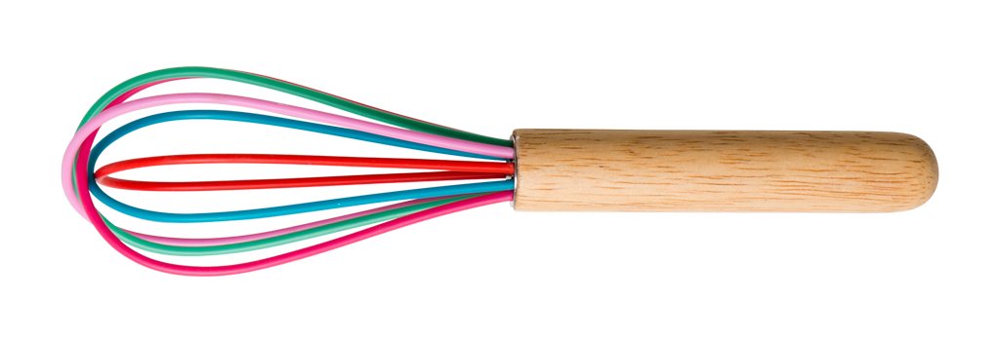
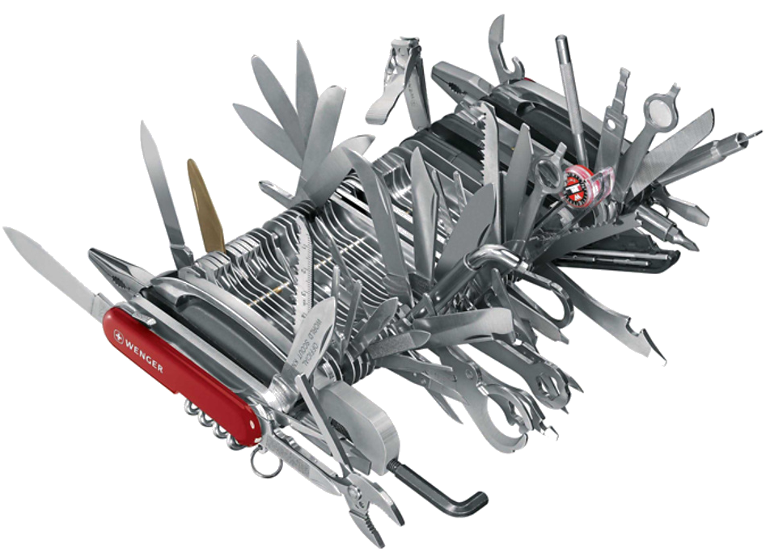

# Week 1

### Today, Friday 7th October 2016

1. [Welcome](#welcome) :)
* What are [apps](#what-is-an-app)? Key concepts: interface, data and logic 
* [Workshop](#workshop): HTML + CSS + JS
* Team project: [Filtr Findr](#team-project)

### Your [homework](#homework) and [blog](#blog)!

# Welcome

1. [What is this course about?](../../README.md)
* [What's the plan?](../../README.md#plan) 
* [What can you learn?](../../README.md#learning-goals)
* [Rules of the road](../../README.md#rules-of-the-road)
* Keeping a **journal** to record your creative process is *extremely* important. Don't let your ideas and thoughts fade away! Think of your project blog as your **digital sketchbook**. More on that [here](https://github.com/RavensbourneWebMedia/Blogging#why-blogging).
* **Peer learning**: [one of the most effective ways](http://visible-learning.org/hattie-ranking-influences-effect-sizes-learning-achievement/hattie-ranking-teaching-effects/) to learn something is to teach it to someone else. During this course you'll be sharing your skills and knowledge in class, leading mini-tutorials and moderating debates. Starting with [your homework for next week](#peer-learning-research)! 

# What is an app?

Let's sketch a **working definition** of *app*.

How do you explain what an app is to someone or something who's never seen/used one, like an *alien*?

<!--
### Your turn

Pretending one of us is an *alien*, let's ask some obvious questions and jot down some answers and key words on post-its. 

If people answer with jargon, like *software* or *download*, then we ask them to explain those too to our *alien*.
-->

* What does an app **look like**?  
* How do you **interact** with an app? Do you speak to it, do you shake it etc?
* What are apps **made out of**?
* **Who uses** apps? Why?

### What is an app, then?

There is no clear-cut definition of *app*.

For the sake of this course, we like to think of apps as small **digital tools** that are **connected** to the Web.

To use an analogy, if a website is like a *book*, which you use to find and consume information, an app is closer to a *whisk*, which you use to make something with.

Apps generally have a specific function, or a small set of functions. They are not trying to do everything.

This is *not* a good app. It is not **usable**, even though all the tools it features could be usable (and possibly useful) on their own.

Good apps do **one thing** and do it well.

## Key concepts

### Interface

The parts of the app you directly interact with (touch, read, click, speak to etc.)

A good interface must be *usable* and should align to a user's *mental models* (how does s/he expect the interface to work). 

### Data

The *fuel* of an app, the raw ingredients that the interface presents to you (more or less *cooked*). 

Data is also the information that you provide an app with: the username you type in, the pictures you upload, the geo-location coordinates apps stream...

### Logic

The **coded rules** that determine how the app interface reacts to your *inputs*, how it manipulates data and how it presents it to you (*output*).

At its core, the logic building blocks of an app are statement that sound like `if {this} then {that}`, eg: `if you click on this button, the app will show you this section`.

Many `if {this} then {that}` blocks can build quite complex behaviours.

# Your brief

### Make an **app** that helps **people** sort through **data** to **find** who/what they are looking for.

**The *who/what* is up to you**. People may be looking for other people in their community to do something together, or they may be looking for food recipes, places to go, books to read, films to watch.. 

No matter which data the app uses, its **logic** will be the same:

1. **Load data** from an online database 
* Capture **user inputs**, when they click on buttons, type into text boxes or choose from a dropdown menu etc.
* **Sort data** according to user choices, for instance filtering out data that doesn't match their choices
* Present a human-readable **output** 

### Interface

Here's an initial sketch of how the app may look and work.

This is what we're focusing on today.

### Logic

Next week we'll learn how to use JavaScript to assign *behaviour* to your interface, coding logic like `if you click this button, then do XYZ`.

We'll also show you that you don't need to write all this code from scratch. There are plenty of ready-made code *libraries* that you can use in your own project. No need to reinvent the wheel!

### Data

We'll learn how to create structured data, aka a **database**. 

No scary formula or data crunching though! 

Over the next weeks you will change the data to make your app serve your own purposes.

# Workshop

### What's a hashtag? 

Imagine you have to explain it to someone or something that has never seen one before (an alien, your grandma..)

This graph from Google Trends illustrates the (search) popularity of the word `hashtag` over time.

### What's a hashtag *for*?

Let's remind ourselves. 

We became so accustomed to hashtags that we almost take them for granted. Yet we don't use hashtags when we talk to each other, or when we text our friends, so **why** do we use them so extensively on social media?

* Do you use hashtags? If yes, which? If not, why?
* What happens when you use a hashtag in a picture / tweet etc? 
* Why do social media services encourage us to use hashtags?

 
### What's hashtag abuse, aka *hashspamming*?

### How can we harness hashtags in our our own projects, to communicate something interesting?

Let's use the Instagram API to build a visualisation of **opposites**:

* healthy - unhealthy
* public - private
* light -dark
* silence - noise
* comedy - tragedy
* consciousness - unconsciousness
* upper class - lower class
* North - South
* what's the contrary of...

<!--- [ ] Examples / inspirations-->
 
#### Pull data from Instagram for **2 opposite hashtags** and build an expressive display

1. Build an HTML skeleton with static data (images and text).
* Spin up a local web-server. Remember [Mamp](https://www.mamp.info/en/)? 
* Get started with the [IG API](http://instagram.com/developer).
* Build the **URL**.
* Download and install [JSONView](https://chrome.google.com/webstore/detail/jsonview/chklaanhfefbnpoihckbnefhakgolnmc?hl=en)
* Request data via JS, see what we get in return (console, inspecting objects).

All the code for this workshop is [here](../../resources/instagram).

<!--See [InstaFeed](../../resources/instafeed) demo.-->

# Team project

### Filter Bubbles 

This **team project** is about pushing yourself out of your online comfort zone (aka *filter bubble*) to observe different communities and express your points of view through code.

All the project material is [here](../../projects/filter-bubbles).

Today:

1. Watch and discuss the [Eli Pariser TED talk video](http://www.ted.com/talks/eli_pariser_beware_online_filter_bubbles?language=en#t-53082).
* Form teams.
* Draw the *edges* of your filter bubbles.
* Set up a GitHub repository for your team project.

Between today and next week:

1. Research communities and *hashtags*, document it on your GitHub repo wiki.
* Discuss and sketch ideas for visualisations. 
* Start experimenting with code, more than one idea. 
* Record your creative process in your blogs.

Next week:

1. Review your ideas and experiments in class.
* Pick one idea to finalise.
* Continue coding.

Between next week and the formative:

1. Refine your work.
* Document your process (research, design and code).

Formative presentation (29.10):

1. Present your work as a team, both process and results.
* Reflect on what you learned from it.

# Homework

### Peer-learning research

7 **teams** of ~3 people each. You may want to stick to the same *Filter Bubbles* team.

Choose a topic to research and teach next week (one per team). Some of them are theory-oriented and some are more practical:

1. [Objects of intense feeling: the case of the Twitter API](http://computationalculture.net/article/objects-of-intense-feeling-the-case-of-the-twitter-api) (TODO pick a section of the article)
* [Data Doppelgängers and the Uncanny Valley of Personalization](http://www.theatlantic.com/technology/archive/2014/06/data-doppelgangers-and-the-uncanny-valley-of-personalization/372780/)? 
* The [Critical Engineering Manifesto](http://criticalengineering.org/) (you can replace `engineer` with `coder` if you feel like making this more relatable)
* The [Conditional Design Manifesto](https://conditionaldesign.org/manifesto)
* [Below the API](http://www.forbes.com/sites/anthonykosner/2015/02/04/google-cabs-and-uber-bots-will-challenge-jobs-below-the-api/)
* Computational thinking
* Functions and functional programming (make examples in JavaScript)
* `for` loops (make examples in JavaScript)

Your team **mini-lesson** (bear in mind, *presentation* does not mean PowerPoint slides.. be creative) should be **~20 minutes** and you may include:

* Summary of main ideas
* Links, images or videos of projects / products / things referenced in your research
* Other relevant things you've read, heard or seen
* Examples and demonstrations
* Personal experiences

Each team should also prepare **1-2 questions for the class**. After your mini-lesson, we will have a short group discussion around these questions.

Make sure your mini-lesson and any other relevant material is **published online** (for instance on GitHub.. but it could be elsewhere as long as it's accessible by anyone). You can publish *after* you've presented next week.

### Project 

Work on *Filter Bubbles* **with your team**:

* Research on your GitHub repo wiki
* Discuss and sketch ideas
* Experiment with code, more than one idea. Next week we'll review them and pick one to finalise.

### Blog 

**Individually**, write about *Filter Bubbles*. Reflect on the concept and document **your** thought process. You can post pictures of scribbled notes, or jot down notes digitally. It doesn't need to be fleshed out and well written. The main goal here is to record your flow of ideas, not to make it beautiful!

<!-- Should ask for opinions on the idea of filter bubbles and examples of filter bubbles in action in their daily online consumption (and offline too?).  -->
